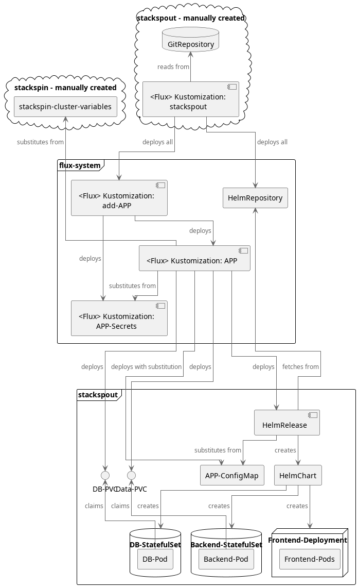

# Stackspin Outwards – Stackspout 🚀

This repository extends [Stackspin](https://open.greenhost.net/stackspin/stackspin)
with extra applications and overrides focused on business use.
Once stabilized, the aim is to contribute as much upstream as possible.

Stackspout is used in day-to-day business
with a double-digit user number,
so all experiments happen carefully.
Still, it is an experimental offering ⚠

## Customizations ⚙

### Overrides 🔧

* Adds many Nextcloud extensions and some configuration
* Allow iFraming of applications into Nextcloud

#### Nextcloud Setup Hints

Photos & Memories:
- occ memories:places-setup
- occ recognize:download-models
  https://docs.nextcloud.com/server/latest/admin_manual/ai/app_recognize.html

## New Applications ➕

Following are the applications Stackspout adds beyond Stackspin.
Unlike Stackspin, there is currently no mechanism to add those individually —
they come in one package with the repository.

Below list is formatted as:

> subdomain: Service (helmrepo, if not by the application authors themselves)

### Stackspin included Tools 🧰

* `dashboard`: Toolübersicht von Stackspin
* `files`: Nextcloud – Tools Hub, Dokumentation, Filesharing, Kalender, Kontakte 📁
* `chat`: Zulip – Kommunikation und Arbeitsdokumentation 💬
* `note`: Hedgedoc – Lebende, kollaborative Dokumente 📝

### Stable including OpenID Connect Single Sign-On 🔐

* `forge`: Forgejo – Code Repositories
* `do`: Vikunja – Projektmanagement
* `status`: Gatus (minicloudlabs) – Status-Überwachung Monitor

### No Single Sign-On 🔓

#### LDAP Support
* `ninja`: InvoiceNinja – Rechnungsstellung, Angebote, ggf. Zeiterfassung 💰 (requires 30$ per year for whitelabeling)
* `support`: Zammad – Kundensupport & Login-Codes 🧾 (updates pending)

#### Paid plan required for SSO
* `flow`: n8n (8gears) – Automatisierungen 🔁
* `meet`: cal.com (pyrrha) – Terminvereinbarungen 📅 ([Enterprise License for SSO](https://cal.com/docs/self-hosting/sso-setup))
* `board`: openproject (https://www.openproject.org/docs/installation-and-operations/installation/helm-chart/) – Projektplanung 📋

### Coming Soon 🔜

* `sign`: Documenso (hat OIDC im Gegensatz zu [Docuseal](https://github.com/zekker6/helm-charts/tree/main/charts/apps/docuseal)) – Signaturen 🔏
* `design`: Penpot – Design-Tool 🎨
* `stirling`: PDF Manipulation Hub / Toolbox

### Planned 📌

* `sprint`: Taiga (nemonik) – Agile Boards 🏃
* `video`: Peertube ([LecygneNoir](https://git.lecygnenoir.info/LecygneNoir/peertube-helm)) – Dezentrales Video-Hosting

### Ideas 💡

* `wiki/know`: Wiki – evtl. Wiki.js, preferred Integration with Nextcloud + Markdown/Orgdown?
* `call`: Jitsi Meet / OpenTalk / Element Call
* `link`: URL Shortener 🔗
* `connect`: Bonfire – Social & Community Tools

### Stale 💤

* `people`: SuiteCRM (bitnami repo)
* `time`: Kimai (robjuz repo)

### Configuration Tasks ☐

- Nextcloud too slow - add Redis?
- Preconfigure user settings in Nextcloud, Vikunja and more

---

## Setup Instructions 🧭

> **Warning:** This toolset is in active experimentation!
> Data loss can happen!

First [install Stackspin](https://docs.stackspin.net/en/latest/installation/install_stackspin.html).
Then apply the configuration to your cluster:

```sh
./install.sh
```

Done!
Note that the added applications are currently only toggled via repository changes
and integration with Stackspin mechanisms is very rudimentary.
To list the central resource related to this repo:

```sh
kubectl get gitrepositories -A
kubectl get kustomization -A -o=jsonpath='{.items[?(@.spec.sourceRef.name=="stackspout")].metadata.name}'
kubectl -n stackspout get helmreleases
kubectl -n stackspout get pods
```

But there are also ConfigMaps, Secrets, StatefulSets, PVCs, Helmrepos and more...

## Tools and Guides

Useful tools for administration:
- my `stack` CLI helper, currently part of my dotfiles:
  https://forge.ftt.gmbh/janek/dotfiles/src/branch/main/.config/shell/server#L21
- stackspin docs:
  https://docs.stackspin.net/en/v2/system_administration/customizing.html

### Adding a new app

Also see https://open.greenhost.net/stackspin/stackspin/-/blob/main/.gitlab/issue_templates/new_app.md?ref_type=heads#source-helmrepository--gitrepository

A template for most of these steps can be generated using https://forge.ftt.gmbh/janek/dotfiles/src/branch/main/.local/bin/scripts/stack-template

- create the HelmRepository in [`infrastructure/sources`](./infrastructure/sources)
- create a folder with app configuration files under [`apps`](./apps)
- add a kustomization for the app into [`apps`](./apps) and add it to [`apps/kustomization.yaml`](./apps/kustomization.yaml) when the app is ready
- add an entry in [`overrides/stackspin-apps-custom.yaml`](./overrides/stackspin-apps-custom.yaml)

### Creating OAuth Credentials for an External Service
- push an OAuth2Client definition like for the apps,
  adjusting `metadata.name` and `spec.secretName` as well as `spec.redirectUris`
- obtain the generated `client_secret` for your application from kubernetes:

      kubectl get secret -n flux-system stackspin-APP-oauth-variables --template '{{.data.client_secret}}' | base64 -d

  with client_id:

      kubectl get secret -n flux-system stackspin-APP-oauth-variables --template '{{.data.client_id}}{{"\n"}}{{.data.client_secret}}{{"\n"}}' | while read in; do echo $in | base64 -d; echo; done


## Explanation - Typical App Deployment in Stackspout with Flux on Kubernetes

The diagram illustrates generically how continuous app deployment works in our Kubernetes cluster
from Infrastructure-as-Code using flux.
Not every app has database, backend and frontend,
but in the end the deployments all work very similarly
so there is no point showing it for each individual app.
Except for the Single-Sign On,
apps also do not really depend on each other.

Explanations:
- deploy :: creates a resource on the cluster from a file in the GitRepository
- create :: creates a resource on the cluster using Kubernetes logic
- ... all :: creates multiple independent resources

All Flux Kustomizations refer to a directory in the GitRepository,
but for clarity I omitted it beyond the initial one.

Clouds are created not via Flux GitOps,
but through one-time scripts.



See also https://about.ftt.gmbh/projects/polygon.html#state-of-stackspout-2022

## Technical Details: How Flux works in Stackspin and Stackspout

> Each code snippet in the text is a Kubernetes resource kind.

Upon installation,
a Flux `GitRepository` is registered with the cluster,
which regularly pulls the latest resource definitions from git,
along with a Flux `Kustomization` pointing at a base folder.
This folder contains further Flux Kustomizations,
each deploying resources from a specific folder in the gitrepository.

In Stackspout, the stackspout-apps `Kustomization` automatically installs the additional application Kustomizations,
while in Stackspin these are added via a script or the dashboard.
For each application,
there is an add-APP `Kustomization`,
which loads an APP-secrets and APP `Kustomization`,
the former generating passwords and OpenID Connect secrets
for use by the APP.
These are then substituted by the APP `Kustomization`
into the `ConfigMap` for the application
along with cluster-wide information from `stackspin-cluster-variables`
such as the domain and IP all services are provided under,
as well as login details for services to send E-Mails.

For each app,
there is a `HelmRelease` pulling a specific version of a `HelmChart` 
from a separately defined `HelmRepository`.
The `HelmChart` defines how to deploy an application, 
similar to a docker-compose file but customizable through a `ConfigMap`,
which depending on the chart leads to deployment of additional services,
creates config files, defines environment variables
and storage and backup mechanisms.
The `HelmRelease` then deploys the resources according to the `HelmChart` with `ConfigMap` values.
This usually creates a few auxiliary resources like ConfigMaps and Secrets,
but the interesting part are the services:
- stateless services are deployed via `Deployments`,
  which can be scaled anytime to a desired number of replicas
- stateful services are deployed via `StatefulSets`
  and get an own storage per pod
For more see for example https://www.airplane.dev/blog/statefulset-vs-deployment

These then create and watch `Pods`,
which usually contain a single docker `Container`
running the actual service component.
Note that one application often consists of multiple components
for example a `StatefulSet` for the database
and a `Deployment` for the frontend.
If the `Pods` store data,
they usually bind to a previously reserved `PersistentVolumeClaim`,
creating a `PersistentVolume` which in Stackspin is a local folder under `/var/lib/local-storage/Stackspin`.

Some quirks to note:
- Flux Kustomizations recursively deploy resources from referenced folders -
  if you want to limit the deployed resources, 
  put a k8s kustomization.yaml into the folder.
  Note the difference in the apiVersion as both are of kind Kustomization!
- Modifications to resources on the cluster managed by flux
  will be reverted regularly upon reconciliation -
  nice for quick testing, but make sure to commit proper changes to the repository.
- If a Kustomization or HelmRelease gets stuck,
  it is sometimes helpful to suspend and resume it.
